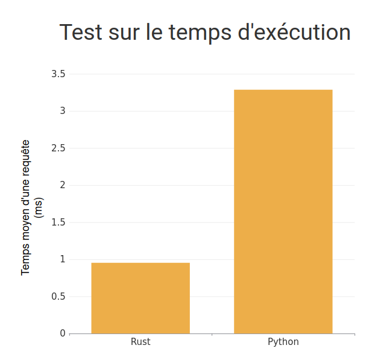
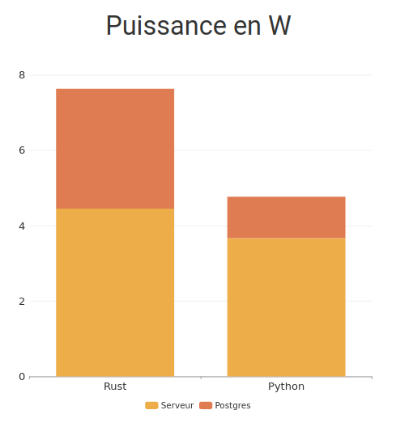
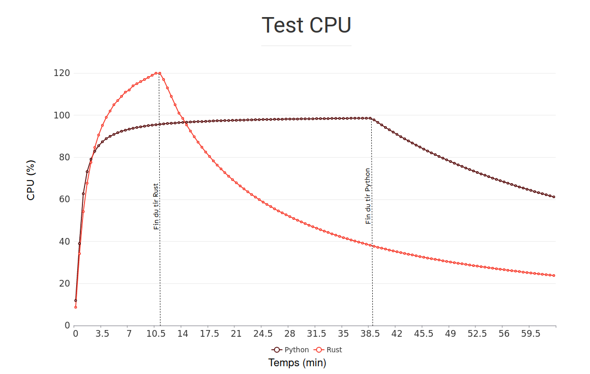

Cette page a pour but de résumer les tests comparatifs entre un serveur Python et serveur Rust.

Nous avons fait deux applications identiques qui font un accès à une base de données de contacts. 

Nous utilisons l'outil apache [ab](https://httpd.apache.org/docs/2.4/fr/programs/ab.html) qui permet d'effectuer un nombre de requêtes HTML donné en argument. ab permet aussi de lancer des requêtes en concurrence. 

Voici les informations du système utilisé : 

`Linux irocoenv 5.8.0-53-generic #60~20.04.1-Ubuntu SMP 1 x86_64 x86_64 x86_64 GNU/Linux`

La machine utilisée pour les tests permet de lancer 4 requêtes en concurrence. Des informations détaillées de la machine utilisée sont disponibles dans le fichier [cpuinfo](./cpuinfo). 

Le scénario de test est l'accès aux données d'un contact sur la page locale : localhost:8080/contacts/1.

Les logs du serveur Python ont été retirés avec l'option `--no-access-log` pour améliorer sa performance et être identique au serveur Rust.
## 1er tir

Commande exécutée : `ab -n 10000 -c 4 localhost:8000/contacts/1`

10 000 requêtes par concurrence soit 40 000 requêtes.

Nous obtenons une moyenne de  0.953 ms/requête pour Rust et 3.286 ms/requête pour Python.

Rust est ainsi 3,44 fois plus performant que Python. Essayons maintenant sur un plus grand nombre de requêtes. 

## 2nd tir

Commande exécutée : `ab -n 5000000 -c 4 localhost:8000/contacts/1`

5 000 000 requêtes par concurrence soit 20 000 000 requêtes.

### Temps d'exécution

Nous obtenons une moyenne de 0.913 ms/requête pour Rust et 3.433 ms/requête pour Python.

Les deux serveurs présentent des chiffres similaires au premier tir et semblent être résistants face à un grand nombre de requêtes.

Essayons maintenant de tester d'autres critères que la vitesse d'exécution.

## 3e tir

Commande exécutée : `ab -n 3000000 -c 4 localhost:8000/contacts/1`

3 000 000 requêtes par concurrence soit 12 000 000 requêtes.

### Temps d'exécution

Nous obtenons une moyenne de 0.897 ms/requête pour Rust et 3.069 ms/requête pour Python.

### Puissance

Nous avons ensuite regarder la puissance des serveurs lors de ces tests grâce à l'outil Scaphandre et Grafana.

Nous obtenons en moyenne pour Rust 4.70W pour le serveur et 3.35W pour la base de données pour 11min20sec d'exécution. Quant à Python, 4.73W pour le serveur et 1.46W pour la base de données pour 38min29sec d'exécution. Rust utilise ainsi moins de puissance car son exécution est plus courte.

### CPU

Commande exécutée : `while true; do ps -p xxx -o %cpu,%mem,time  --no-headers >> CPU_name; sleep 30; done` où `xxx` est le PID du serveur.

Comme pour la puissance, Rust utilise plus de CPU lors de son exécution mais celle est beaucoup plus courte.

## 4e tir

Commande exécutée : `ab -n 25000000 -c 4 localhost:8000/contacts/1`

Nous essayons maintenant de voir les limites du serveur Rust en lui envoyant un très grand nombre de requêtes : 25 000 000/concurrence soit 100 000 000 requêtes. 

Le serveur présente une nouvelle fois une moyenne similaire (0.955 ms/requête).
